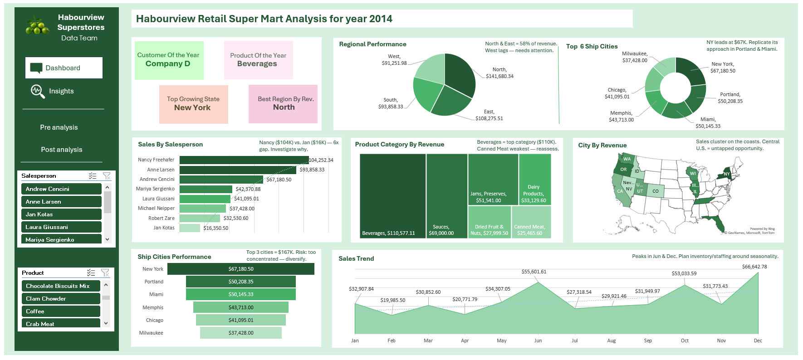

# De Angels Super Mart — Sales Analysis 2014

## Overview
A Microsoft Excel-based sales performance analysis of Habourview Retail Super Mart for the year 2014, covering salesperson performance, regional revenue breakdown, product category insights, city and state distribution, and monthly sales trends. Built as part of the Vephla University Data Analytics Programme.

---

## Dashboard Preview


---

## Tools Used
- Microsoft Excel
  - Pivot Tables
  - VLOOKUP
  - Bar Charts, Line Charts, Pie Charts, Treemap, Radar Chart, Map Chart
  - Slicers for interactive filtering
  - Interactive KPI Dashboard

---

## Key Findings

| Metric | Result |
|---|---|
| Total Revenue (2014) | $317,712.81 |
| Top Salesperson | Nancy Freehafer ($104,252.34) |
| Top Region | North ($141,680.34) |
| Top City | New York ($67,180.50) |
| Top Product Category | Beverages ($110,577.11) |
| Top Customer | Company D ($67,200.00) |
| Peak Month | December ($66,642.78) |
| Lowest Month | February ($19,985.50) |

---

## Salesperson Performance

| Salesperson | Region | Total Revenue |
|---|---|---|
| Nancy Freehafer | North | $104,252.34 |
| Anne Larsen | South | $93,858.33 |
| Andrew Cencini | East | $67,180.50 |
| Mariya Sergienko | West | $42,370.88 |
| Laura Giussani | East | $41,095.01 |
| Michael Neipper | North | $37,428.00 |
| Robert Zare | West | $32,530.60 |
| Jan Kotas | West | $16,350.50 |

---

## Product Category Performance

| Category | Revenue |
|---|---|
| Beverages | $110,577.11 |
| Sauces | $69,000.00 |
| Jams & Preserves | $51,541.00 |
| Dairy Products | $33,129.60 |
| Dried Fruit & Nuts | $27,999.50 |
| Canned Meat | $25,465.60 |

---

## Repository Files

| File | Description |
|---|---|
| `TASK_21_GEORGE_NZUBECHI_CHIBUIKEM_VEPH-50B-DA079.xlsx` | Full Excel workbook with raw data, pivot tables, charts, and interactive dashboard |
| `Technical_Report_De_Angels_Super_Mart_2014.docx` | Full technical report covering all 11 analytical sections |
| `dashboard.png` | Screenshot of the full interactive dashboard |
| `README.md` | Repository overview and project documentation |

---

## Project Structure

```
de-angels-supermart-sales-analysis-2014/
│
├── TASK_21_GEORGE_NZUBECHI_CHIBUIKEM_VEPH-50B-DA079.xlsx
├── Technical_Report_De_Angels_Super_Mart_2014.docx
├── dashboard.png
└── README.md
```

---

## Key Insights
- Nancy Freehafer alone generated approximately 33% of total team revenue, representing a significant personnel dependency risk
- The North region dominated with $141,680.34 — roughly 35% more than the next closest region
- Beverages accounted for nearly 35% of total product revenue, making it the business's single most critical product category
- Most salespersons were anchored to a single city, exposing the business to single-market risk
- December was the peak month while February was the lowest, revealing a strong seasonal pattern
- The West region had three salespersons yet underperformed relative to the North and East regions

---

## Recommendations Summary
- Develop a succession and support plan for top performers like Nancy Freehafer
- Expand each salesperson's city portfolio to reduce single-market dependency
- Launch mid-year campaigns to address the consistent Q1/Q2 revenue dip
- Invest in growing mid-tier product categories through bundling and promotions
- Review and rebalance the West region's three-way territory split
- Implement a structured performance improvement plan for underperforming salespersons

---

## Author
**George Nzubechi Chibuikem**
Student ID: VEPH/50B/DA079
Data Analytics Programme
Vephla University
2026
